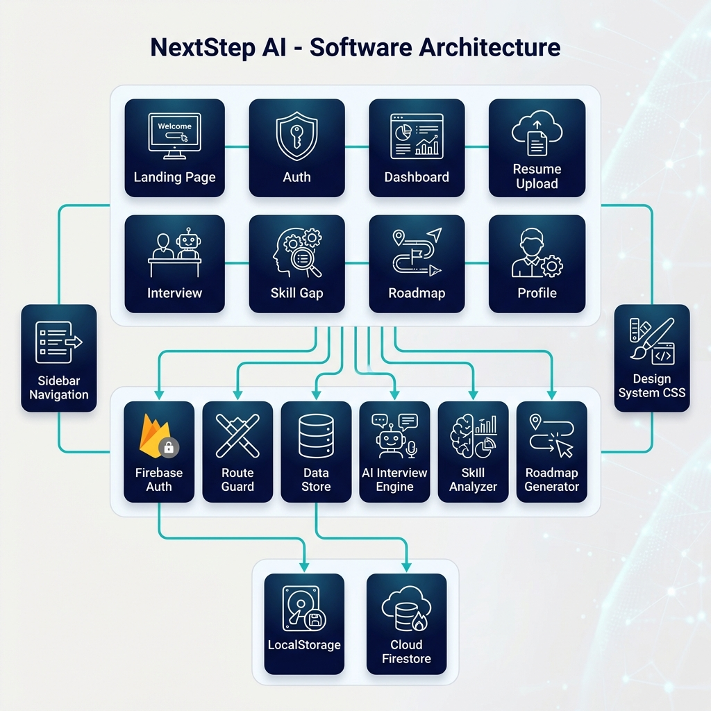

# NextStep AI 🚀

> **Your AI-Powered Career Co-Pilot** — Bridging the gap between where you are and where you want to be.

  

---

## 📋 Overview

NextStep AI is an intelligent career guidance platform that helps students, freshers, and career switchers navigate their path to success. The platform combines AI-powered resume analysis, adaptive mock interviews, personalized learning roadmaps, and skill gap analysis to provide a comprehensive career preparation experience.

---

### 📊 Career Readiness Analytics
- **Dynamic Donut Visualization** — Progressive-weighted ring segments for accurate skill tracking
- **Centralized Score Focus** — Real-time overall readiness score display with backdrop-blur effects
- **Interactive Tooltips** — Detail-rich hover interactions for every readiness segment

###  Smart AI Resume Analysis
- **Live Gemini AI Integration** — Performs deep multimodal analysis of PDF resumes for precise skill extraction
- **AI-Powered Skill Validation** — Automatically detects and categorizes technical, soft, and industry-specific skills
- **ATS Compatibility Score** — Real-time evaluation of how well your resume performs with modern ATS models
- **Actionable Suggestions** — Get AI-generated feedback on how to improve your resume for your target role
- **Experience & Project Parsing** — Context-aware extraction of work history and technical project impact

### 🎤 Adaptive AI Interviews
- **Real-Time AI Evaluation** — Every answer is analyzed by Gemini AI for logic, approach, and technical accuracy
- **Adaptive Question Engine** — Dynamically generates questions based on your resume and interview performance
- **Advanced Answer Methods**:
  - **Monaco Code Editor** — Professional VS Code-powered environment with "Run Code" simulation
  - **Speech-to-Text** — Real-time transcription using Web Speech API for behavioral responses
- **Live Proctoring Simulator** — Interactive webcam feed and behavioral analysis for realistic practice
- **AI Voice Interaction** — Optional AI-guided interview experience with speech synthesis
- **Immediate Feedback** — Get per-question analysis on strengths and areas for improvement

### 🗺️ Personalized Learning Roadmap
- **Dynamic 6-Week Plan** — Tailored learning path generated from your specific skill gaps
- **AI Roadmap Nudges** — "Refine with AI" feature to customize your journey using natural language prompts
- **Live Resource Integration** — Real-time YouTube tutorials and LeetCode problems fetched via SerpAPI
- **Interactive Checklist** — Track progress across Learn, Practice, and Interview tasks
- **🎉 Completion Celebration** — Automated celebration with job board links and "Next-Level" skill suggestions

### � Live Skill Gap Analysis
- **Market Search Integration** — Scans live industry trends via SERP for your specific target role
- **Automated Market Scan** — Trigger analysis automatically with debounced career goal inputs
- **Contextual Comparison** — Compares your resume skills directly against current market demands
- **Clean Grid Layout** — Optimized multi-column display for clear visual categorization
- **Prioritized Learning** — Categorizes skills into Must-Have, Good-to-Have, and Future-Proof
- **Direct Roadmap Sync** — One-click integration to update your roadmap with identified gaps

### 🎨 Premium UI/UX Ecosystem
- **Compact Sidebar Navigation** — Streamlined vertical navigation with dynamic progress tracking
- **Live Stat Integration** — Real-time readiness % and daily streak badges in the sidebar
- **Orbital Feature Timeline** — Interactive visualization of the career preparation journey
- **Magic Bento Grid** — Modern, dense information display with hover-reactive cards
- **Infinite Plane Background** — Dynamic, grid-based animation for a high-end feel
- **Consistent Pro Branding** — Custom `favicon.svg` branding integrated across all application pages
- **Click Spark Effects** — Engaging micro-interactions for every user action

---

## 🏆 Hackathon Demo Guide

**For Judges & Presenters:** This project is **Hackathon Ready**.

### 🛡️ Fail-Safe Demo Mode
The AI service includes a robust **Fallback Mechanism**. If the Gemini API is rate-limited or unreachable during the presentation, the system will automatically serve high-quality pre-generated interview questions. **The demo will not crash.**

### 🌟 Key Flows to Showcase
1.  **Resume Analysis**: Upload a resume to see the "Magic Scanning" animation and skill extraction (simulated for speed).
2.  **AI Interview**:
    -   Start a "Mixed" interview.
    -   Show the **Monaco Editor** integration.
    -   Demonstrate **Speech-to-Text** (allows for natural answers).
    -   Show the **Toast Notifications** (try submitting empty code).
3.  **Roadmap**: Generate a personalized roadmap based on the interview performance.


---

## 🛠️ Tech Stack

| Technology | Purpose |
|------------|---------|
| **HTML5** | Structure and semantics |
| **CSS3** | Styling with Glassmorphism and modern patterns |
| **Vanilla JavaScript** | Core logical engine and state management |
| **Google Gemini API** | Live AI analysis, evaluation, and generation |
| **SerpAPI** | Real-time market data and learning resources |
| **Firebase Auth** | Secure User Identity |
| **Firebase Hosting** | Fast and secure static web hosting |
| **Cloud Firestore** | Cloud persistence for user profiles |
| **GSAP** | Sophisticated page transitions and UI animations |
| **Monaco Editor** | Professional-grade code editing environment |
| **Custom UI Systems** | Toasts, Skeleton loaders, and Interactive components |

---

## 📁 Project Structure

```
NextStep-AI/
├── index.html          # Landing page with hero section
├── auth.html           # Authentication (Login/Signup)
├── onboarding.html     # Multi-step Onboarding Wizard
├── dashboard.html      # User dashboard with stats
├── resume.html         # Resume upload and analysis
├── interview.html      # AI mock interview system
├── skill-gap.html      # Skill gap analysis
├── roadmap.html        # Personalized learning roadmap
├── profile.html        # User profile management
├── feedback.html       # Interview feedback display
├── 404.html            # Custom error page
├── css/
│   ├── styles.css      # Main stylesheet
│   ├── editor.css      # Code editor styling
│   ├── page-transitions.css # Smooth animations
│   ├── micro-interactions.css # Button effects
│   ├── mobile-responsive.css # Mobile optimization
│   ├── empty-states.css # Placeholder templates
│   ├── onboarding.css  # Onboarding wizard styles
│   └── ...other components
└── js/
    ├── gemini-service.js   # Centralized AI engine
    ├── serp-service.js     # Live market search integration
    ├── interview-engine.js # AI-driven interview logic
    ├── interview-media.js  # Voice & Video processing
    ├── roadmap-engine.js   # Personalized path generation
    ├── roadmap-customizer.js # AI prompt-based refinement
    ├── toast-notifications.js # Toast system
    ├── loading-states.js # Premium loaders
    ├── orbital-timeline.js # Interactive feature visualization
    ├── click-spark.js     # Micro-interaction engine
    └── ...other modules
```

---

## 📊 Visual Documentation

### System Architecture

*Complete system architecture showing client layer, application flow, and backend services*

### User Journey Flow

*Sequential user journey from landing to dashboard (16:9 format)*

### UI Wireframes

*Key screen wireframes: Landing, Dashboard, Interview, and Roadmap pages*

---

## 🚀 Getting Started

### Prerequisites
- A modern web browser (Chrome, Firefox, Edge, Safari)
- No build tools required! (Uses ES Modules)

### Deployment
This project is configured for **Firebase Hosting**.

1.  **Install Firebase CLI**
    ```bash
    npm install -g firebase-tools
    ```

2.  **Login and Deploy**
    ```bash
    firebase login
    firebase deploy
    ```

### Installation

1. **Clone the repository**
   ```bash
   git clone https://github.com/sameerreddy789/CareerPilot.git
   ```

2. **Navigate to the project**
   ```bash
   cd CareerPilot
   ```

3. **Open in browser**
   - Simply open `index.html` in your browser
   - **Recommended:** Use VS Code "Live Server" to handle ES Modules gracefully

---

## 🎮 How to Use

1. **Sign Up** — Create accounts with Email or Google
2. **Complete Onboarding** — Tell us about your goals and upload your resume
3. **View Dashboard** — See your personalized readiness score
4. **Take Mock Interviews** — Practice with AI-powered questions
5. **Follow Roadmap** — Complete your learning plan
6. **Celebrate & Apply** — Finish roadmap, get job links, explore advanced skills

---

## 🎨 Design Philosophy

- **Dark Theme** — Easy on the eyes for extended study sessions
- **Modern Color Palette** — Carbon Slate theme with clean blue accents
- **Glassmorphism Effects** — Premium feel with backdrop blur
- **Responsive Layout** — Mobile-first design with hamburger menu
- **Micro-animations** — Delightful interactions with ripple effects and transitions
- **Accessibility First** — WCAG compliant with keyboard navigation and ARIA labels
- **Progressive Enhancement** — Core features work without JavaScript
- **Performance Optimized** — Fast page loads with CSS-only animations where possible

---

## 👥 Target Audience

| User Type | Use Case |
|-----------|----------|
| **Students** | Prepare for campus placements with mock interviews |
| **Freshers** | Bridge the gap between academics and industry |
| **Career Switchers** | Transition smoothly to a new domain |
| **Returning Professionals** | Update skills after a career gap |

---

## 🔮 Future Roadmap

- [ ] Video interview analysis
- [ ] Company-specific interview prep
- [ ] Peer mock interviews
- [ ] Mobile app version

---

## 🤝 Contributing

Contributions are welcome! Feel free to:
1. Fork the repository
2. Create a feature branch (`git checkout -b feature/amazing-feature`)
3. Commit your changes (`git commit -m 'Add amazing feature'`)
4. Push to the branch (`git push origin feature/amazing-feature`)
5. Open a Pull Request

---

## 📄 License

This project is licensed under the MIT License - see the [LICENSE](LICENSE) file for details.

---

## 👨‍💻 Author

**Sameer Reddy**  
Built with ❤️ for Hackathon

---

<p align="center">
  <strong>© 2026 NextStep AI. All rights reserved.</strong>
</p>
