# NextStep AI - Architecture Diagram

```mermaid
graph TB
    subgraph Frontend["🖥️ Frontend Layer"]
        HTML[HTML Pages]
        CSS[CSS Styles]
        JS[JavaScript]
        
        subgraph Pages["Pages"]
            P1[index.html]
            P2[auth.html]
            P3[resume.html]
            P4[interview.html]
            P5[skill-gap.html]
            P6[roadmap.html]
            P7[dashboard.html]
            P8[profile.html]
        end
        
        subgraph Components["Components"]
            C1[Sidebar]
            C2[Progress Cards]
            C3[Modals]
            C4[Charts]
        end
    end
    
    subgraph Services["⚙️ Service Layer"]
        GS[gemini-service.js]
        RS[RoadmapEngine]
        SS[SerpService]
    end
    
    subgraph Firebase["🔥 Firebase"]
        FA[Firebase Auth]
        FS[Firestore DB]
    end
    
    subgraph AI["🤖 AI Services"]
        GM[Google Gemini API]
    end
    
    subgraph External["🌐 External APIs"]
        YT[YouTube API]
        LC[LeetCode Search]
        SERP[SERP API]
    end
    
    subgraph Storage["💾 Local Storage"]
        LS1[User Data]
        LS2[Resume Data]
        LS3[Interview Results]
        LS4[Roadmap Progress]
    end
    
    %% Connections
    HTML --> JS
    CSS --> HTML
    JS --> Services
    
    Services --> Firebase
    Services --> AI
    Services --> External
    Services --> Storage
    
    GS --> GM
    SS --> SERP
    SERP --> YT
    SERP --> LC
    
    FA --> FS
```



## Architecture Components

### Frontend Layer
| Component | Technology | Purpose |
|-----------|------------|---------|
| Pages | HTML5 | Page structure and content |
| Styles | CSS3 | Visual styling and animations |
| Logic | Vanilla JS | Interactivity and API calls |
| Sidebar | JS Component | Navigation across pages |

### Service Layer
| Service | File | Purpose |
|---------|------|---------|
| Gemini Service | `gemini-service.js` | AI-powered resume parsing, interview analysis |
| Roadmap Engine | `roadmap-engine.js` | Generate personalized learning roadmaps |
| SERP Service | `serp-service.js` | Fetch YouTube/LeetCode resources |

### Firebase Services
| Service | Purpose |
|---------|---------|
| Authentication | Email/Password, Google OAuth |
| Firestore | User profiles, progress data |

### AI Integration
| API | Usage |
|-----|-------|
| Google Gemini | Resume parsing, interview evaluation, roadmap generation |

### External APIs
| API | Purpose |
|-----|---------|
| SERP API | Search YouTube tutorials |
| SERP API | Search LeetCode problems |

### Local Storage Keys
| Key | Data Stored |
|-----|-------------|
| `nextStep_user` | User profile data |
| `nextStep_resume` | Parsed resume data |
| `nextStep_interview` | Interview responses |
| `nextStep_roadmap_progress` | Completed tasks |

## Data Flow

```
User Action → Frontend → Service Layer → API/Storage → Response → UI Update
```

1. **Authentication Flow**: User → Auth Page → Firebase Auth → Firestore → Dashboard
2. **Resume Flow**: Upload → Gemini Parse → Store → Display Skills
3. **Interview Flow**: Questions → Responses → Gemini Analyze → Skill Assessment
4. **Roadmap Flow**: Skills + Gaps → Generate Plan → Track Progress → Celebrate
