# NextStep AI - User Flow Diagram

```mermaid
flowchart TD
    A[🌐 Landing Page] --> B{User Logged In?}
    
    B -->|No| C[🔐 Auth Page]
    C --> D{Login or Signup?}
    D -->|Signup| E[Create Account]
    D -->|Login| F[Enter Credentials]
    D -->|Demo| G[Demo Mode]
    E --> H[✅ Authenticated]
    F --> H
    G --> H
    
    B -->|Yes| H
    
    H --> I{Resume Uploaded?}
    I -->|No| J[📄 Resume Upload Page]
    J --> K[Upload PDF/DOCX]
    K --> L[AI Parses Resume]
    L --> M[✅ Resume Stored]
    
    I -->|Yes| M
    
    M --> N{Interview Done?}
    N -->|No| O[🎥 AI Interview Page]
    O --> P[Answer 5 Questions]
    P --> Q[AI Analyzes Responses]
    Q --> R[✅ Interview Complete]
    
    N -->|Yes| R
    
    R --> S[📊 Skill Gap Analysis]
    S --> T[Compare Skills vs Role]
    T --> U[Generate Gap Report]
    
    U --> V[🗺️ Personalized Roadmap]
    V --> W[Weekly Learning Plan]
    W --> X[Tasks with Resources]
    
    X --> Y[📈 Dashboard]
    Y --> Z{Continue Learning?}
    
    Z -->|Complete Task| AA[Mark Task Done]
    AA --> AB[Update Progress]
    AB --> Y
    
    Z -->|View Resources| AC[YouTube/LeetCode Links]
    AC --> Y
    
    Z -->|All Done| AD[🎉 Roadmap Complete!]
    AD --> AE{Next Steps?}
    AE -->|New Skill| V
    AE -->|Find Jobs| AF[Job Links]
```

## User Journey Steps

### 1. Authentication
- User lands on homepage
- Clicks "Get Started"
- Signs up with email or Google OAuth
- Optional: Demo Mode for testing

### 2. Resume Upload
- Upload PDF or DOCX resume
- AI (Gemini) extracts:
  - Skills
  - Experience
  - Education
  - Projects

### 3. AI Interview
- 5 role-specific questions
- Voice/text responses
- AI evaluates answers
- Generates skill assessment

### 4. Skill Gap Analysis
- Compare current skills vs target role
- Identify gaps
- Prioritize learning areas

### 5. Personalized Roadmap
- 6-week structured plan
- Weekly topics with tasks
- YouTube tutorials
- LeetCode problems
- Progress tracking

### 6. Dashboard
- Overall progress %
- Streak tracking
- Quick actions
- Recent activity
